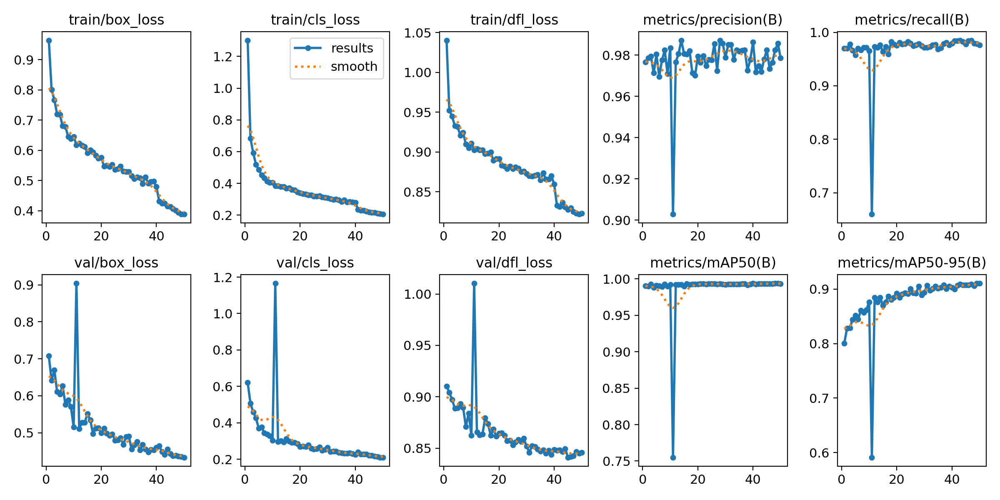

# YOLOv8 类子弹头状器件刻印区域检测

## 一、项目背景

在工业质检场景中，需要在金属器件尖端表面识别凹印/凸印编号。该类目标存在以下难点：

- 金属反光强，局部过曝
- 刻印字符尺寸小、对比度低
- 部分样本无刻印（负样本）
- 图像存在倾斜、旋转与尺度变化

> 注：本项目为个人验证性质，基于 1813 张样本完成算法原型验证，不涉及真实产线部署。

## 二、数据集说明

- 来源：实习单位内部采集（受保密协议限制，不公开原始数据）
- 规模：1813 张工业图像
- 标注：YOLO 格式，单类别（刻印区域）
- 划分：训练集 1631 张，验证集 182 张
- 特殊处理：对无刻印样本引入空标签文件，避免训练阶段漏检惩罚

### 标注预处理逻辑

本项目为单类别检测任务，仅关注“刻印区域”。然而在早期标注及导出过程中，部分 YOLO 标签文件的首字段（类别 ID）可能为数字、字母或非零映射结果，而非统一的 `0`。

YOLOv8 在解析标签时，若类别 ID 无法映射到 `data.yaml` 中定义的类别索引，会**静默忽略整行标注**，既不报错也不告警。这可能导致一种隐蔽问题：**标签文件存在，但训练时并未真正生效**。

为避免上述问题，同时保证 OCR 输入纯净，采取以下策略：

- 标注阶段仅框选印刷体刻印区域；
- 手写体编号视为背景，不予标注，避免污染后续 OCR 输入；
- 编写 `tools/labelsTOyolo.py`，对标签进行标准化处理：
  - 不修改原始标签文件；
  - 读取 `labels/*.txt`；
  - 将每行第一个字段统一改写为 `"0"`，以适配单类别检测任务；
  - 保留剩余四个字段（归一化后的 x, y, w, h）；
  - 输出至 `labels_yolo/*.txt`。

该方案确保：
- 检测阶段仅关注“刻印区域是否存在”；
- 字符内容由后续 OCR 模块独立识别；
- 消除因类别 ID 不一致导致的标注静默失效问题；
- 单类别训练标签保持统一、可控。

## 三、环境依赖

安装命令：

pip install -r requirements.txt

> 建议使用 GPU 环境以获得正常训练速度与性能。CPU 环境仅适合流程验证。

主要依赖：

- Python>=3.8
- PyTorch>=2.0
- Ultralytics YOLOv8
- OpenCV
- paddlepaddle==3.3.1
- paddleocr==3.7.0
- Matplotlib

## 四、快速开始

### 4.1 准备数据配置

复制示例配置，并根据实际路径修改，生成本地私有配置文件：

#### Linux / Mac
```bash
cp data.yaml.example data.yaml
```

#### Windows PowerShell
```bash
copy data.yaml.example data.yaml
```

> `data.yaml.example` 为配置模板，`data.yaml` 为实际使用的本地配置文件。  
> `data.yaml` 已被加入 `.gitignore`，不会上传至 GitHub，避免泄露本地或服务器路径。

数据配置内容（服务器环境示例）：

```yaml
train: /root/autodl-tmp/dataset/train.txt
val: /root/autodl-tmp/dataset/val.txt
names:
  0: tip_number_region
```

### 4.2 训练模型

#### GPU（推荐）
```bash
yolo train model=yolov8n.pt data=data.yaml epochs=50 imgsz=640 batch=8 device=0
```

#### CPU（仅调试）
```bash
yolo train model=yolov8n.pt data=data.yaml epochs=5 imgsz=640 batch=2 device=cpu
```

### 4.3 推理测试
```bash
yolo predict model=runs/detect/bullet_tip_v1/weights/best.pt source=dataset/images/val save=True
```

> 注：`bullet_tip_v1` 为示例训练输出目录，实际使用时请根据 `runs/detect/` 下的具体文件夹名调整。

## 五、实验结果

### 5.1 本地 CPU 验证结果（流程正确性验证）

- 目的：验证训练流水线连通性及标签解析一致性（排除静默失效风险）
- 硬件：AMD Ryzen 7 7730U（无独显）
- mAP50：0.994
- mAP50-95：0.889
- 推理速度：127 ms / 张

> 注：CPU 结果仅用于功能验证，不代表模型性能上限。

### 5.2 GPU 训练结果（AutoDL RTX 3080 Ti，50 Epochs）

- Epochs：50
- mAP50：0.994
- mAP50-95：0.910
- Precision：0.986
- Recall：0.979
- 推理速度：0.6 ms / 张
- 训练耗时：~12 min

> 注：GPU 结果为实际性能参考，后续实验与评估均基于此配置。

## 训练曲线



## 六、项目结构
```text
.
├── assets/                    # 静态资源
│   └── results.png            # 训练曲线图
├── weekly_reports/            # 个人实习周报（不提交）
├── notes.md                   # 个人学习笔记（不提交）
├── requirements.txt           # 项目依赖清单
├── data.yaml.example          # 数据配置模板（参考用）
├── data.yaml                  # 本地私有配置（不提交，由 data.yaml.example 复制生成）
├── train.py                   # 训练脚本
├── tools/                     # 工具脚本目录
│   ├── labelsTOyolo.py        # 标签标准化脚本（统一类别 ID 为 0）
│   ├── test_env.py            # 环境测试脚本
│   └── test_single_image.py   # PaddleOCR 单图推理测试脚本
├── runs/                      # 训练输出目录（不提交，含 best.pt / results.png 等）
├── yolov8n.pt                 # YOLOv8n 预训练权重（不提交，首次训练自动下载）
└── README.md                  # 项目说明文档
```
说明：
- 带（不提交）标记的文件/目录已加入 `.gitignore`，不会上传至 GitHub；
- 实际训练使用 `data.yaml`，该文件仅存在于本地，由使用者根据环境自行创建，不会被版本管理；
- `weekly_reports/` 存放个人实习周报，不纳入版本管理与项目交付范围；
- 使用者需根据 `data.yaml.example` 创建本地配置。

## 七、当前进度说明
- ✅ 已完成刻印区域检测模型的训练、验证与文档化
- ✅ PaddleOCR 3.x 环境与新 API 已跑通，单图推理无底层崩溃
- ⏳ 原始刻印图直接 OCR 当前存在 0 文本区域检出情况，需结合 YOLO ROI 与图像增强进一步验证
- ⏳ 待在现有数据集分布下，验证复杂光照与强反光场景下的检测稳定性

**下一步计划**：基于检测框进行 ROI 裁剪，并接入 PaddleOCR / CRNN 完成字符识别链路验证。

> 说明：当前版本面向实验室验证，未覆盖真实产线环境下的长期稳定性与极端工况鲁棒性测试；若后续手写体误检频发，计划引入 OCR 后处理过滤或强负样本训练进行优化。

## 八、后续工作
- 优化强反光与小目标场景下的检测稳定性
- 接入 PaddleOCR / CRNN 完成刻印字符端到端识别
- 针对倾斜刻印设计自适应增强策略

## 九、更新日志

### 2026-08-07（第三天）
- 重构 `train.py`，移除过期数据清洗注释，新增 CPU 调试专用文档字符串（Docstring）
- 完善 README 中 CPU / GPU 训练说明，明确 CPU 指标仅用于流程验证
- 在 `requirements.txt` 中补充 PyTorch CPU / GPU 安装指引
- 确立“代码管逻辑、文档管使用、notes 管实验”的信息分层规范

> 说明：今日重点由功能验证转向工程规范化，明确训练脚本的最小化职责，避免文档误导后续使用者。

### 2026-08-06（第二天）
- 明确项目为个人验证性质，暂不追求工业级鲁棒性
- 确认标注策略：手写体编号刻意不标，视为背景，避免污染 OCR 输入
- 梳理 YOLO 与 OCR 分工：YOLO 负责定位，OCR 负责识别，后处理负责过滤误检
- 制定迭代路线：优先完成 OCR 后处理方案（一期），视时间再优化检测阶段手写体排斥能力（二期）
- 补充 LabelImg 字母映射导致类别 ID 非 0 的隐蔽问题说明
- 新增 `tools/test_single_image.py`，用于 PaddleOCR 3.x 单图推理验证
- 确认 PaddleOCR 初始化需添加 `enable_mkldnn=False`，以规避 PaddleX/oneDNN/PIR 相关 `NotImplementedError`
- 初步验证：PP-OCRv6 对原始金属刻印图直接推理可能返回 0 个文本区域
- 明确后续方向：不能依赖通用 OCR 直接识别原始工业刻印图，需要 YOLO ROI 裁剪 + 图像增强/二值化/CLAHE 后再识别
- 新增 `requirements.txt`，锁定 PaddlePaddle==3.3.1 与 PaddleOCR==3.7.0，确保环境可复现

### 2026-08-05（第一天）
- 完成 YOLOv8 模型训练、验证与文档初稿
- 完成数据集划分与标注预处理脚本开发（`tools/labelsTOyolo.py`）

## ⚠️ 关于 CPU / GPU 的说明

- 本项目默认推荐使用 GPU 进行训练与评估；
- `train.py` 中 `device="cpu"` **仅为本地调试用途**，不代表模型设计或性能基准；
- CPU 环境下的指标仅用于验证训练流程与数据正确性；
- 实际性能、推理速度与 mAP 均以 GPU（RTX 3080 Ti）结果为准。